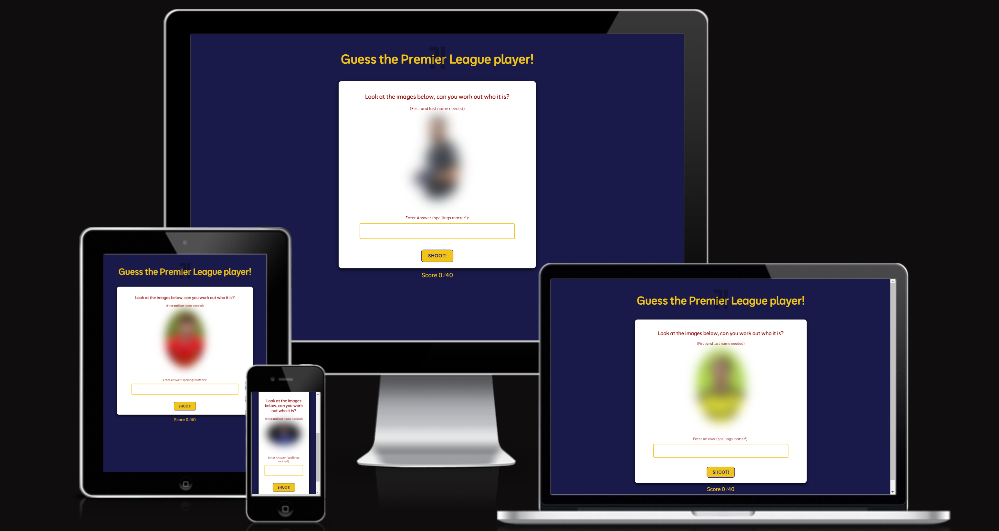
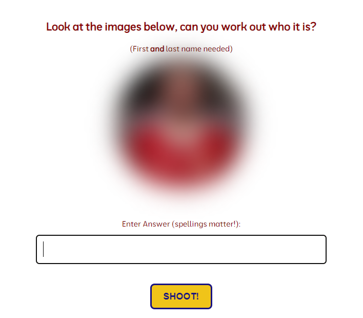
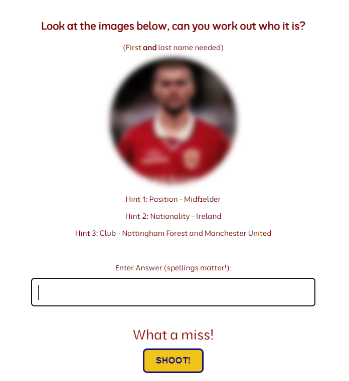
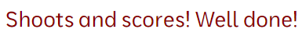
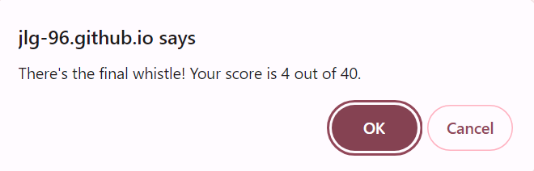

# Guess the Premier League Player

"Guess the Premier League Player" is an interactive JavaScript based game that has been designed specifically for football enthusiasts, testing their knowledge of Premier League stars past and present. 
The game aims to challenge users to identify Premier League legends through progressively revealed images and hints. It is targeted at football fans and anyone who would love an interactive challenge to expand their Premier League knowledge in a fun and engaging way. 
*Guess the Premier League Player* is a fully responsive JavaScript game, with a large library of players to keep the user entertained, they will be challenged to get as high a score as they can by guessing the player in as little attempts as possible.

## Features
- **Guess the Premier League Player Logo and Heading**
  - The heading and logo are placed at the top of the page to make for easy viewing for the user. It immediately sets the theme of the game and engages users from the start.
  

- **Game Area** 
  - The main section was desgined with a traditional 'football card' in mind. A clear and easy to navigate area, in which the game can be carried out. This section is where the user will be presented with a view of a blurred image of a Premier League footballer and they then must attempt to guess the player's name. 
  - Users will type their answers in the input box and can submit by either pressing *Enter* or clicking the "Shoot!" button. 
  - Whether the user is correct or incorrect they will still be automatically taken to the next image - to allow a free-flowing feel and to keep the users attention on the image and the game itself. 

- **Image Reveal and Hints**
  - The game has a unique feature, which is to progressively reveal more of the image and provide hints depending on how difficult the user is finding that particular image. With each incorrect guess, more of the image is revealed and a hint is provided.
  - The user will have a maximum of 4 attempts to guess correctly, with a total of 3 hints provided to help them.
  - The hints reveal the players *position, nationality and club*. The reason for revealing these hints in this order is to generate more of a challenge (presenting the club early will allow users to narrow down their options a lot quicker).

- **Score Area**
  - This section displayers the users current score out of a total of 40 points. 
  - Points decrease with each hint used, with the design to give a greater reward to the players who are able to guess correctly with fewer hints.
  - The feature helps the user keep track of their performance and encourages replayability by seeing if the user can beat their own score.
  - Users can recieve a maximum of 4 points or a lowest of 0. Users could also challenge other users to see who is best.
  

- **Answer Input Focus**
  - The input field automatically focuses when the game loads to give clear indication to the user where the main play area of the game is. After each incorrect and when the next image is presented, the input field remains focussed to provide a smooth user experience.

- **Submitting answers with Enter Key**
  - Users are able to submit their answers by pressing the "Enter" key, this is to enhance the gameplay experience by providing convenience and allowing the user to submit answers quickly.

- **Feedback provided to user**
  - Feedback is provided to the user throughout the game. As it is a football game the feedback has been designed to with this theme in mind. Providing a more submersive and enhancing experience.
   
  
  
  
  

- **Player reveal and next question**
  - Whenever the user is correct, the game reveals the player immediately, allowing the user to see the player in the kit of a team they do / used to played for.
  - If a user struggles to get it correct after all available attempts, part of the feedback for the user is that the player is revealed to show the unblurred image along with the correct name. Spellings are important and that is reflected in this game, so revealing the correct spelling will allow the user to know how to get the answer right next time.
  - Whether a user is correct / incorrect and they are finished with the image, the game automatically reveals another image for the user to guess. Designed to keep the game fluid by providing a smooth transition and keep the user immersed. 

- **Opportunity to play again** 
  - At the end of the game the user is provided with their total score out of 40. They are also provided with the opportunity to replay the game. By pressing "okay" this will reset the game. This was so the user doesn't have to keep reloading the game to play and to help encourage replayability. With a library of 28 players, this should provide the user with enough variety and challenge to be entertained. 

- **Features left to implement**
  - Progress checker. A way for the user to know how much they have progressed through the game so far. This could be a percentage bar or just numbering each image from 1 - 10. 
  - Leaderboard. A future feature would include a leaderboard where users can see how their high scores compete against others globally / locally, adding a further competitive element and hoping to enhance the replayability. 
  - A share feature will be implemented to allow users to challenge other users to beat their score.
  - Expanding the player library. Adding more players to increase the variety within the game, combining recent players with older players. The update could allow the addition of Premier League managers. 
  - The use of audio will be implemented in a future update to give the game a different dimensional feel. For example, a full time whistle at the end of the game, start whistle, fans groan when an answer incorrect and fans cheer when answer is correct. 

  *The code institues **Love Maths and Love Running** project helped provide code for the game, including; part of the main structure, providing an alert as feedback, how to single out an object from within an array, the code to focus the cursor, have the enter button as submit.*

## Testing
  - The game has been extensively tested to ensure that it works as intended. 
    - The game has been tested using different browsers (Chrome, Safari and Edge) to ensure that it works. Functions such as the hint reveal, gradual reveal of images, score updating, alert feedback, in-game feedback, and Enter key submissions work correctly.
    - Media queries were implemented to esnure a smooth user experience across a variety of devices.

 -  #### Validator testing
    - HTML 
      - No errors were returned when passing each page through the official W3C validatior (https://validator.w3.org/).

    - CSS
      - No errors were discovered when passing through the official CSS validator (https://jigsaw.w3.org/css-validator/).

    - JavaScript 
      - No errors were found when passing through the official Jshint validator (https://jshint.com/).
        - There are 10 functions in this file. 
        - Function with the largest signature take 1 arguments, while the median is 0. 
        - Largest function has 17 statements in it, while the median is 5.5. 
        - The most complex function has a cyclomatic complexity value of 5 while the median is 2.
    
  - #### Unfixed bugs
    - Occasionally, whilst the image is loading, it very briefly appears unblurred. This is against the design and can make the game slightly easier for the user. I believed to have fixed this bug by applying the "blurred" class setting before the image source, however this has not been successful. 
      - In a future update, I plan to fix this bug by providing a countdown / a different image for which the blurred image player can load properly behind before being shown to the user. 
    - The user can keep "spamming" the submit button and this causes the game to flick through images. This doesn't allow the user to gain an advantage because it will only hinder their total score. However, a future update looking at disabling the submit button once all the hints have been revealed can be implemented to correct this. 

## Deployment
- The site was deployed to GitHub pages. It has been deployed using the following steps:
    - In the GitHub repository (named: *guess-PL-player*) scroll down until you come across deplyments on the right hand side.
    - Click the github-pages link. 
    - Click the link within the github-pages box.
    - This will open a separate tab with the successfully deployed site. 

The live link can be found here; https://jlg-96.github.io/guess-PL-player/

## Credits 

  - Content
    - Within the website the code institute helped provide the coding for;
      - Alerts. 
      - Targetting an object within an array. 
      - Splice. 
      - Focus the cursor in the text box. 
      - Keydown for Enter key. 
      - Functions. 
      - If, else if and if.
      - And how to implement Math.floor and Math.random

    - W3Schools have helped throughout the project by providing additional information and clarity in areas where I lacked understanding. 

    - Help with the blurred images part of the game was provided from this site; https://stackoverflow.com/questions/62039703/blur-an-image-with-javascript

  - Media 
    - Player images were taken from google images. They have mainly come from the corresponding clubs website. 
    - The logo was taken from google images.
